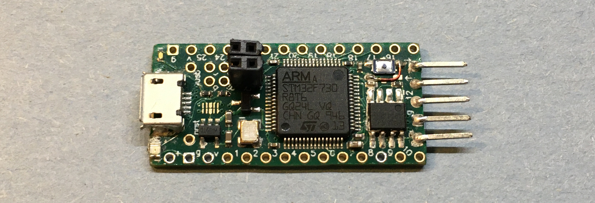
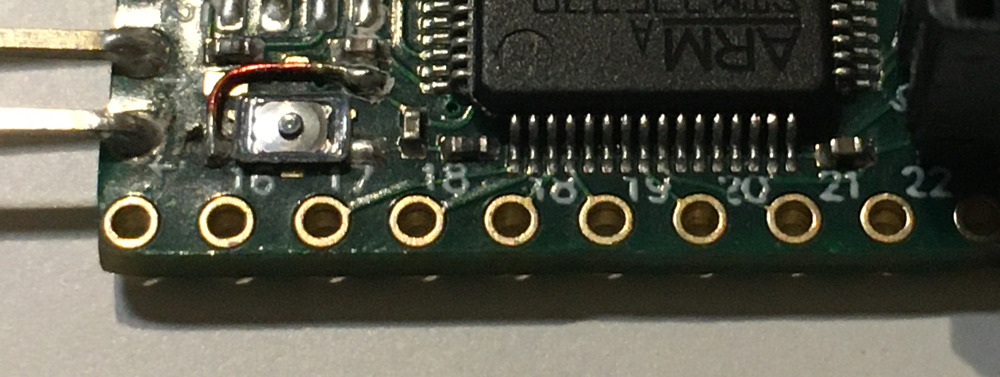

# Overview

CS Ranka is a performant, flexible, and economical development platform for the STM32F7 series of microcontrollers.

We selected the [STM32F730](https://www.st.com/en/microcontrollers-microprocessors/stm32f730r8.html) in LQFP64 package with its minimal internal flash to reduce cost, while simultaneously maintaining the performance and flexibility of other chips in the family by featuring the same Cortex-M7 core and on-board USB HS physical layer. [A low cost 32Mbit serial flash chip](http://www.fmsh.com/nvm/FM25W32_ds_eng.pdf) is included which adds to internal flash of the F730, creating a more cost-effective solution.

The formfactor of Ranka N1 is loosely based off of [Teensy](https://www.pjrc.com/teensy/), and parallels Arduino Nano. Great care has been taken to select breakout pins that expose the most peripheral ports for maximized flexibility and capability. Our design makes available 5 serial ports (3 are USARTs), 2 SPI resources, 3 I2C resources, 10 ADC pins, 1 CAN bus, and USB HS through micro-B connector (FS/HS selectable via jumper). The increased communication interfaces on board make Ranka N1 more versatile than most other devices of its formfactor. (Arduino Nano/Uno, Teensy 4.0/3.2, Maple Mini/Blue Pill, NodeMCU, Feather 32u4, just to name a few). Combined with compute performance that is only bested by the iMX RT1062 chip aboard [Teensy 4.0](https://www.pjrc.com/store/teensy40.html), Ranka N1 is an excellent choice for projects that demand more performance than an Arduino Nano or Maple Mini, while keeping cost at top priority.

## Design Choices

Originally, we intended to use the QUADSPI port for communicating with the external serial flash. However, data pin 2 was not present on the LQFP64 package of STM32F730, so we instead reserved F730's third SPI resource exclusively for use with flash. (using SPI3 would cause problems later)
 
Solderable jumpers on the bottom of the device allow users the option to decide if they would like VUSB disconnected from VIN. Additional jumpers on D+ and D- lines of the USB micro-B connector are wired to the USB FS pins by default. Users may cut the default net tie and solder bridge the USB HS data pins if they wish to sacrifice SPI2's functionality for improved data transmission rates.

We chose a [25MHz oscillator](https://lcsc.com/product-detail/SMD-Oscillators-XO_EPSON_Q33310F70032100_SG-310SCF-25MHZ-3-3V-40-85_C32526.html) as per ST recommendations for best stability of high-speed peripherals. Supply decoupling capacitors were included as well for improved stability. The current revision of Ranka N1 does not feature a dedicated analog power section, as there is not enough room granted for two power supply sections. Since the MCU is an LQFP package, it's technically possible to solder to the pins directly if a dedicated analog supply section is desired.

## Realization

ST provided sample [STM32F746NG](https://estore.st.com/en/stm32f746ngh6-cpn.html) chips for evaluation. Since we do not have any breakout boards for the BGA package, we made Ranka N0.1 and N0.2 using dead bug prototyping method to begin developing software targeting STM32F7 devices. As you can see, the result isn't too elegant

Schematic of minimal components specifically for the microcontroller are derived from [ST's documentation](https://www.st.com/resource/en/application_note/dm00164549-getting-started-with-stm32f7-series-mcu-hardware-development-stmicroelectronics.pdf). Rail regulation and protection consist of a reverse blocking P channel enhancement mode MOSFET and a low dropout regulator selected mostly for efficiency. We omitted TVS diodes or current limiting on VIN due to space limitations with our current process.

The board is routed according to design rules based on JLCPCB's [capabilities](https://jlcpcb.com/capabilities/Capabilities). We chose to use any-angle/topographical routing for Ranka N1 primarily for improved efficiency and aesthetics. While any-angle routing is superior to conventional methods, we are still in the experimentation phase and will continue to perfect our method in upcoming revisions.

## Results

The physical boards were fabricated and assembled without issues. External flash chip, user button, and micro-USB type B port required manual soldering as they are not available for SMT assembly service. Buttons of the exact footprint had not been acquired, so a bodge was done for prototyping.

Our expectations were met after initial testing with power rail measurements and software toolchain demos. Using STM32CubeMX init code generator and HAL quick start code, we successfully blinked the user LED on board!

## Revision Opportunities
Choosing SPI3 for boot loading from flash seemed to be a bad idea. We did not consider the possibility that the specific peripheral device would not support boot loading like SPI1, 2, or QUADSPI. One possible workaround to this issue is to manually wire SPI1 pins to the external flash footprint from broadside pin headers. DAC and four analog channels would be occupied by the on-board external flash. This would not be feasible for production/release but will be adequate for prototyping.

The debug connectors certainly could be designed better. 2x4 array of through hole headers with a pitch of 2mm proved to be difficult to work with. Perhaps consider aligning SWD pins in one column for future designs, so a much less complex programming harness and receptacle may be utilized.

Additionally, there was a mistake with the pin numbering on the top side silkscreen. Pin 18 was counted twice and numbers after 18 are offset by one. It doesn't affect functionality in any way, aside from being inconvenient and annoying. 

## Future Plans

We plan to use Ranka N1 as a starting point for our projects using the STM32 series of microcontrollers. In the future, we plan to produce development boards targeting the STM32MP1 microprocessor lineup, as they offer compute performance unseen in any microcontroller boards on the market today.

We may produce another revision of these boards targeting the same STM32F730 microcontroller, addressing the flaws presented, however our development efforts may be better spent pursuing alternate solutions and platforms, as the main goals of Ranka N1 include process demonstration and familiarization.

## JLCPCB

We want to briefly acknowledge support from [JLCPCB](https://jlcpcb.com/) as they have made this whole project possible. Previously, when we were still learning to create PCBs, JLCPCB customer assurance supported us and would always notify us if there was a problem with our board. This was extremely helpful and the combined flexibility and cost savings JLCPCB offers has kept us grateful for their efforts to inspire hobbyists like us.

After ordering approximately 500 PCBs for numerous projects, JLCPCB has consistently offered quick and easy customer support, affordable prices, and plenty of flexibility for a wide range of products. We recommend it to any hobbyist trying to create their personal circuit boards.

# License
This work is licensed under a [Creative Commons Attribution-NonCommercial-ShareAlike 4.0 International License][cc-by-nc-sa].

[cc-by-nc-sa]: http://creativecommons.org/licenses/by-nc-sa/4.0/
